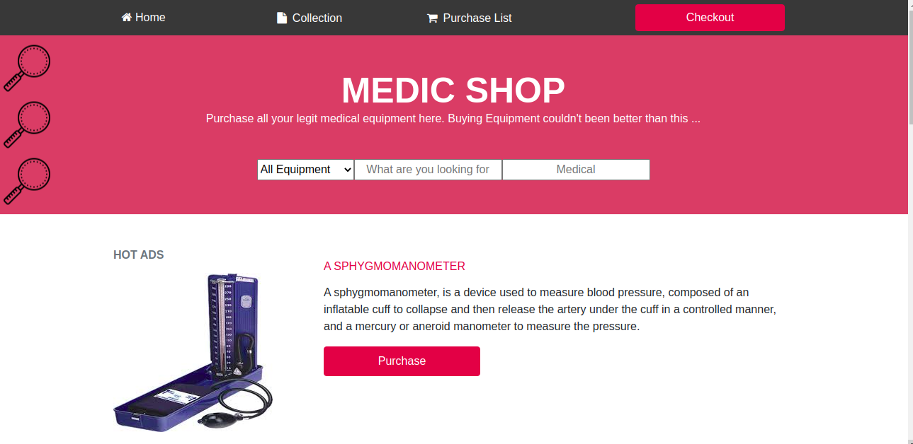

# Project Name

> The project is a static online shop for medical equipment built with HTML, CSS and Bootstap. The site is responsive on mobile,ipads, and desktops

This is a simple application where the user can view different medical equipment. There is no functionality on the buttons just presentation. 

## Built With

- HTML
- CSS
- Bootstrap

## Live Demo

[Live Demo Link](https://raw.githack.com/Datagirlcmr/medicshop/features/index.html)

## Getting Started

Here are the steps to follow in order to get this project on your local computer.

### Setup

clone this repo by typing `git clone`

## Author

👤 **Selma ndi**

- Github: [@githubhandle](https://github.com/Datagirlcmr)
- Twitter: [@twitterhandle](https://twitter.com/SelmaNdi)
- Linkedin: [linkedin](https://www.linkedin.com/in/selma-ndi-datagirl-imba-8976ab32/)

## 🤝 Contributing

Contributions, issues and feature requests are welcome!

Feel free to check the [issues page](https://github.com/Datagirlcmr/medicshop/issues).

## Show your support

Give a ⭐️ if you like this project!

## Acknowledgments

- [dog ceo api](https://dog.ceo/dog-api/)
- Hat tip to anyone whose code was used
- Mohammed Awad, for design inspiration
- etc

## 📝 License

This project is [MIT](lic.url) licensed.
